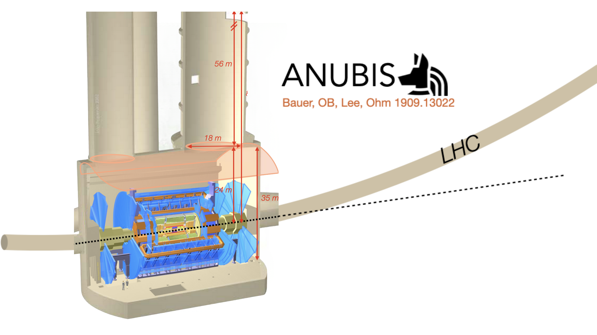

SET-ANUBIS documentation
========================

SET-ANUBIS (*Simulation, accEptance and sensiTivity studies framework for
ANUBIS*) is a modular framework for evaluating the sensitivity of the proposed
ANUBIS detector to long-lived-particle (LLP) scenarios. It connects the model,
generation and detector-analysis stages of a sensitivity study through a common
set of Python interfaces.

The framework begins from a BSM model, typically supplied in Universal Feynman
Output (UFO) format. It can evaluate or ingest decay widths, branching ratios
and lifetimes; prepare MadGraph and optional Pythia workflows; convert HepMC
events into analysis objects; model the ATLAS cavern and ANUBIS tracking
stations; and apply the truth-level selection used to estimate acceptance.

.. raw:: html

   

     <strong>How to use this manual.</strong> Start with the program overview and
     installation pages. The remaining chapters follow the scientific workflow:
     generation, decay properties, geometry-aware selection, reproducibility and
     release validation.
   

Physics context
---------------

ANUBIS is a proposed transverse LLP detector at LHC Point 1. The detector
concept places resistive-plate-chamber tracking stations in the ATLAS cavern and
service-shaft infrastructure. This provides sensitivity to neutral LLPs that
leave the main ATLAS detector before decaying into charged final states in the
surrounding cavern volume.

   ANUBIS ceiling-detector concept and LHC Point-1 geometry, reproduced from
   the ANUBIS proposal (arXiv:1909.13022) under CC BY-NC-ND 4.0. The PDF page
   was converted to PNG without altering its content.

The purpose of SET-ANUBIS is to express this detector concept as a reproducible
analysis pipeline. Model parameters, generator cards, event samples, geometry
configurations and selection outputs can be related through explicit interfaces
and recorded provenance.

.. image:: images/set-anubis-architecture.jpg
   :width: 95%
   :align: center
   :alt: SET-ANUBIS software architecture

Contents
--------

.. toctree::
   :maxdepth: 2

   ProgramOverview
   Installation
   MadGraphGeneration
   BranchingRatioCalculation
   SelectionWorkflow
   Pythia
   DashApplications
   Reproducibility
   CIAndDocs
   ReleaseUpdate
   api/public_api

Public import layer
-------------------

The Python distribution is named ``SetAnubis``. User code should normally import
from the lower-case facade:

.. code-block:: python

   from setanubis import (
       SetAnubisInterface,
       MadGraphCommandConfig,
       GeneralCardInterface,
       SelectionConfig,
       SelectionPipelineBuilder,
       DecayInterface,
       CalculationDecayStrategy,
       ufo_path,
   )

The internal ``SetAnubis.core`` modules remain available for framework
development, but the facade defines the documented public API and is the most
stable entry point for analyses.

Examples and interactive tools
------------------------------

The repository contains worked examples for the main scientific workflows:

* model and UFO inspection;
* branching-ratio, decay-width and lifetime calculations;
* MadGraph card and scan preparation;
* Pythia command-file generation;
* HepMC ingestion and ANUBIS selection;
* stage-by-stage selection reports using real and synthetic events.

Two optional Dash applications provide complementary visual checks. The HepMC
explorer displays LLP decays and tracks in the cavern geometry, while the
database dashboard audits stored runs, content-addressed artefacts and compact
selection bundles.

Citation, archival and licence
-------------------------------

Citation metadata is provided in the repository ``CITATION.cff`` file. The
temporary software-article reference should be replaced by the final CPC DOI
when that record becomes public. The HNL sensitivity study obtained with
SET-ANUBIS is available at https://arxiv.org/abs/2606.26862.

The repository includes ``.zenodo.json`` metadata for archiving tagged releases.
After the GitHub-Zenodo integration has created the first deposit, the Zenodo
concept DOI should be added to both the README and ``CITATION.cff``. SET-ANUBIS
is distributed under GPL-3.0-or-later.

Indices and tables
------------------

* :ref:`genindex`
* :ref:`modindex`
* :ref:`search`
