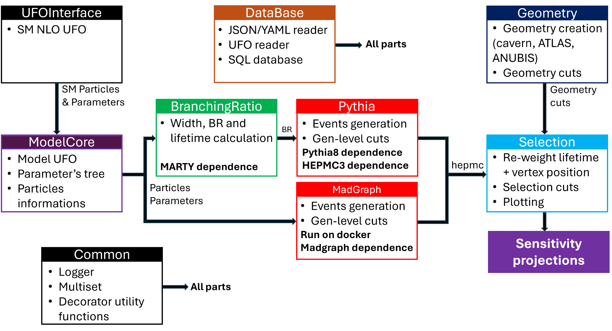

SET-ANUBIS documentation
========================

SET-ANUBIS is a modular Python/C++ framework for ANUBIS long-lived-particle
sensitivity studies.  It provides an end-to-end pipeline for model handling,
branching ratios and lifetimes, event generation, geometry, selection and
reproducible event storage.

Contents
--------

.. toctree::
   :maxdepth: 2

   Installation
   BranchingRatioCalculation
   Pythia
   ReleaseUpdate
   api/modules

Public API
----------

For user scripts, prefer short imports:

.. code-block:: python

   from setanubis import SetAnubisInterface, PythiaRunInterface, ufo_path

The internal ``SetAnubis.core`` paths remain available for advanced use, but the
short API is the stable public entry point for examples and documentation.

Citation
--------

Please cite the software and the associated preprint placeholder:
https://arxiv.org/abs/2512.14942

Indices and tables
------------------

* :ref:`genindex`
* :ref:`modindex`
* :ref:`search`
