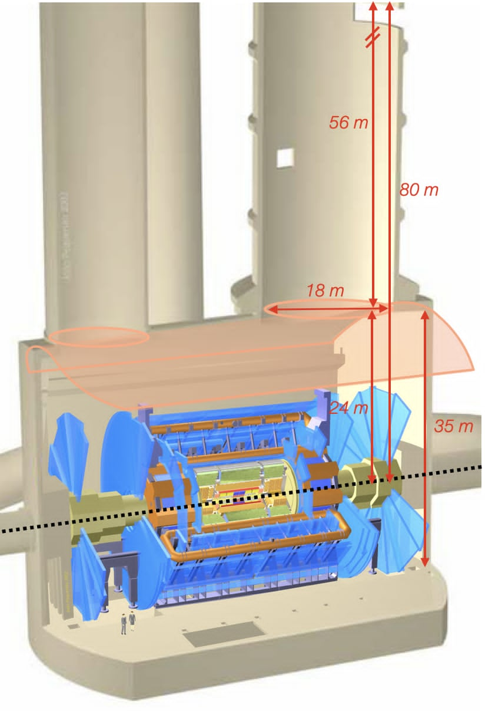

# SET-ANUBIS

[](https://github.com/SET-ANUBIS/set-anubis/actions/workflows/ci.yml)
[](https://github.com/SET-ANUBIS/set-anubis/actions/workflows/docs.yml)
[](https://github.com/SET-ANUBIS/set-anubis/actions/workflows/codeql.yml)
[](https://github.com/SET-ANUBIS/set-anubis/actions/workflows/release.yml)
[](https://pypi.org/project/SetAnubis/)
[](https://pypi.org/project/SetAnubis/)
[](https://pypi.org/project/SetAnubis/)
[](https://github.com/SET-ANUBIS/set-anubis/releases)
[](LICENSE)
[](https://arxiv.org/abs/2512.14942)

**SET-ANUBIS** (*Simulation, accEptance and sensiTivity studies framework for
ANUBIS*) is a Python/C++ framework for projecting the sensitivity of the proposed
**ANUBIS** detector to long-lived particles (LLPs).  The code follows the
analysis strategy used in the SET-ANUBIS paper: describe a BSM model through UFO
inputs, evaluate widths/branching ratios, generate signal samples, ingest the
resulting HepMC events, propagate LLP decays through an ATLAS-cavern/ANUBIS
geometry model, and apply the truth-level cutflow used to estimate geometric and
kinematic acceptance.

ANUBIS is a proposed transverse LLP detector at LHC Point 1, intended to
instrument the ATLAS underground cavern with RPC tracking stations.  Its physics
motivation is to recover LLP decays that can occur outside the main ATLAS
detector but inside the cavern volume, where dedicated tracking layers could
observe charged decay products.  For detector details and physics motivation see
the original ANUBIS proposal, the recent ANUBIS detector/sensitivity paper, and
the SET-ANUBIS software paper listed in [Citation](#citation).

<p align="center">
  
</p>

## Physics workflow

SET-ANUBIS is organised around the analysis pipeline rather than around a single
generator.  The main release examples focus on **MadGraph generation**,
**branching-ratio/lifetime handling**, **geometry-aware selection**, and
**sensitivity inputs**.  Pythia remains available as an optional backend for
standalone generation, showering studies and cross-checks, but it is not the
central public workflow.

<p align="center">
  
</p>

The principal components are:

- **UFO and model interface**: load UFO models, expose model parameters and
  particle content, and produce parameter cards suitable for generator scans.
- **Branching ratios and lifetimes**: combine Python formulas, interpolation
  tables, UFO/MadGraph strategies and MARTY-oriented workflows to provide widths,
  BRs and lifetimes to generation and sensitivity calculations.
- **MadGraph campaign generation**: build MadGraph job scripts, run cards,
  parameter cards, MadSpin cards and shower cards for HNL-like or generic BSM
  scan points.
- **Database and provenance**: store cards, banners, scan metadata, HepMC
  references and compact selection-ready dataframe bundles with reproducible
  metadata.
- **ATLAS cavern and ANUBIS geometry**: model the cavern volume, the ATLAS
  exclusion region, the PX14/PX16 shafts and configurable ANUBIS RPC tracking
  layers.
- **Selection cutflow**: first require the LLP decay to occur in the relevant
  detector geometry, then require charged decay products to intersect ANUBIS
  stations, and only afterwards apply MET and isolation cuts motivated by the
  ATLAS-associated background rejection strategy.
- **Sensitivity projections**: use acceptance values from the cutflow together
  with luminosity, production cross sections, branching ratios and signal
  efficiencies to compute expected LLP yields.

## Installation

```bash
python -m pip install SetAnubis
```

For development:

```bash
git clone https://github.com/SET-ANUBIS/set-anubis.git
cd set-anubis
python -m pip install -e ".[dev,docs,selection,madgraph]"
python -m pytest -q setanubis/tests
```

Useful optional extras:

```bash
python -m pip install "SetAnubis[selection]"  # adds pyhepmc integration
python -m pip install "SetAnubis[madgraph]"   # compatibility extra; Docker SDK is already included
python -m pip install "SetAnubis[app]"        # Dash event/database inspection tools
python -m pip install "SetAnubis[docs]"       # local Sphinx documentation
```

### Optional Pythia/HepMC3 binding

The default wheel is Python-only.  The native Pythia8/HepMC3 extension is built
only when explicitly requested:

```bash
SETANUBIS_BUILD_PYTHIA=1 \
SETANUBIS_PYTHIA8_DIR=/path/to/pythia8 \
SETANUBIS_HEPMC3_DIR=/path/to/hepmc3 \
python -m pip install --no-binary SetAnubis "SetAnubis[pythia]"
```

For a local checkout, helpers are provided to build external copies first:

```bash
./External_Integration/install.sh HepMC3 Pythia
SETANUBIS_BUILD_PYTHIA=1 \
SETANUBIS_PYTHIA8_DIR=$PWD/External_Integration/Pythia/pythia8315 \
SETANUBIS_HEPMC3_DIR=$PWD/External_Integration/HepMC3/hepmc3-install \
python -m pip install -e ".[pythia]"
setanubis-pythia-check
```

See [`PYTHIA_PACKAGING.md`](PYTHIA_PACKAGING.md) for the native-extension policy.

## Official import layer

The PyPI distribution is named **SetAnubis**, but the recommended user-facing
Python import is the lower-case facade:

```python
from setanubis import (
    SetAnubisInterface,
    MadGraphCommandConfig,
    GeneralCardInterface,
    SelectionConfig,
    SelectionPipelineBuilder,
    DecayInterface,
    CalculationDecayStrategy,
    ufo_path,
)
```

This follows the usual Python convention for importable modules and is the API
used in the public documentation.  The internal `SetAnubis.core...` package paths
remain available for advanced users and backwards compatibility, but examples
should prefer `from setanubis import ...`.

## Example: HNL-oriented MadGraph card generation

This example constructs the text artefacts needed for a Heavy Neutral Lepton
(HNL) scan without launching MadGraph.  The same cards can be passed to the local
or Docker runner once a MadGraph installation is configured.

```python
from setanubis import (
    SetAnubisInterface,
    MadGraphCommandConfig,
    GeneralCardInterface,
    ufo_path,
)

model = SetAnubisInterface(str(ufo_path("UFO_HNL")))

config = MadGraphCommandConfig(
    neo_set_anubis=model,
    model_in_madgraph="UFO_HNL",
    shower="py8",
    madspin="ON",
    cache=False,
)

cards = GeneralCardInterface(config)
cards.run_card_builder.set("nevents", 2000)
cards.run_card_builder.set("ebeam1", 6800)
cards.run_card_builder.set("ebeam2", 6800)

cards.madspin_builder.clear_decays()
cards.madspin_builder.add_decay("decay n1 > ell ell vv")

job = cards.jobscript_builder
job.add_process("generate p p > n1 ell # [QCD]")
job.set_output_launch("HNL_ANUBIS_scan")
job.configure_cards()
job.add_parameter_scan("MN1", "[0.5, 1.0, 2.0]")
job.add_parameter_scan("VeN1", "[1e-6, 1e-5]")

print(job.serialize())
print(cards.run_card_builder.serialize())
print(cards.madspin_builder.serialize())
```

More examples are in [`setanubis/SetAnubis/examples/MadGraph`](setanubis/SetAnubis/examples/MadGraph).

## Example: selection configuration matching the nominal cutflow

The nominal selection follows the physics ordering described in the paper:

1. keep decaying LLP candidates;
2. require the decay vertex to be in the cavern or selected shaft geometry;
3. reject decays inside the ATLAS detector volume;
4. require the LLP trajectory and charged decay products to hit the ANUBIS RPC
   stations;
5. apply MET, by default `MET > 30 GeV`;
6. apply jet/charged-track isolation using `Delta R` thresholds.

```python
from setanubis import (
    ATLASCavern,
    GeometrySelectionAdapter,
    SelectionGeometryAdapter,
    SelectionConfig,
    RunConfig,
    MinThresholds,
    MinDR,
    SelectionPipelineBuilder,
    SelectionManager,
    EventsBundleSource,
)

cavern = ATLASCavern()
geometry = SelectionGeometryAdapter(GeometrySelectionAdapter(cavern))

selection = SelectionConfig(
    geometry=geometry,
    minMET=30.0,
    minP=MinThresholds(LLP=0.1, chargedTrack=0.1, neutralTrack=0.1, jet=0.1),
    minPt=MinThresholds(LLP=0.0, chargedTrack=5.0, neutralTrack=5.0, jet=15.0),
    minDR=MinDR(jet=0.4, chargedTrack=0.4, neutralTrack=0.4),
    nStations=2,
    nIntersections=2,
    nTracks=2,
)

pipeline = (
    SelectionPipelineBuilder()
    .set_options(add_jets=True, compute_isolation=True, selection_mode="standard")
    .build()
)

source = EventsBundleSource.from_bundle_file("sample_bundle.pkl.gz")
combined = SelectionManager(pipeline).run_many(
    named_sources=[("HNL_scan_point", source)],
    sel_cfg=selection,
    run_cfg=RunConfig(reweightLifetime=False, plotTrajectory=False),
)
print(combined.cutflow_sum)
```

> **Trusted-input note:** pickle-based selection/database bundles can execute
> arbitrary Python code when loaded. Only open bundles produced by a trusted
> workflow or obtained from a verified source; see [`SECURITY.md`](SECURITY.md).

## Reproducibility and CPC examples

The source release contains deterministic examples for ModelCore, branching
ratios without MARTY, Pythia CMND construction, MadGraph card construction and
selection from the bundled `hnl_df.csv` input. They do not launch external
generators.

```bash
python -m pip install -e .
python reproducibility/run_all.py --output-dir reproducibility_outputs
```

A successful run creates `reproducibility_outputs/VALIDATED` after comparing the
outputs with [`reproducibility/expected_results.json`](reproducibility/expected_results.json).
See [`reproducibility/README.md`](reproducibility/README.md) for scope, provenance
and trusted-input notes.

## Documentation

Build locally with:

```bash
python -m pip install -e ".[docs]"
setanubis-docs --open
```

The hosted documentation is expected at:

```text
https://set-anubis.github.io/set-anubis/
```

## Citation

If SET-ANUBIS contributes to your work, please cite the software preprint and the
ANUBIS detector references relevant to your study:

```bibtex
@article{SETANUBIS2025,
  title   = {SET-ANUBIS: a modular pipeline for ANUBIS long-lived particle sensitivity studies},
  author  = {SET-ANUBIS contributors},
  year    = {2025},
  url     = {https://arxiv.org/abs/2512.14942}
}
```

Recommended ANUBIS references:

- M. Bauer, O. Brandt, L. Lee and C. Ohm, *ANUBIS: Proposal to search for long-lived neutral particles in CERN service shafts*, arXiv:1909.13022.
- ANUBIS Collaboration, *The ANUBIS detector and its sensitivity to neutral long-lived particles*, arXiv:2510.26932.
- T. Reymermier et al., *ANUBIS: Projected Sensitivities and Initial Results from the proANUBIS demonstrator with Run 3 LHC data*, arXiv:2512.14942.

## License

SET-ANUBIS is distributed under the MIT License.  See [`LICENSE`](LICENSE).
