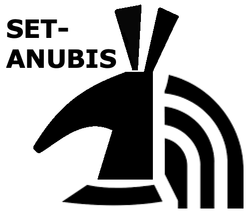
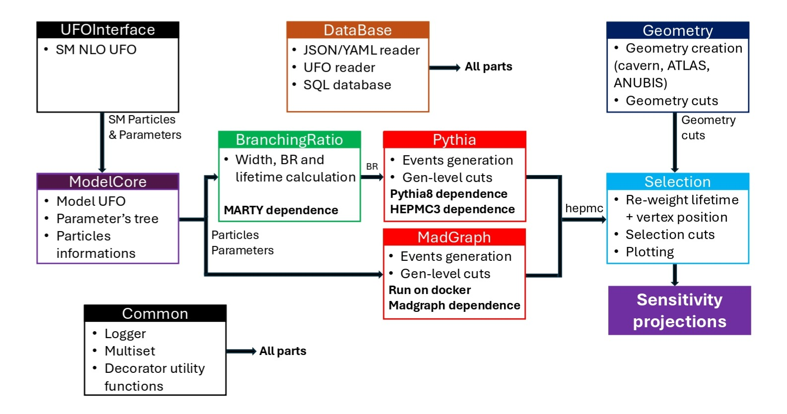

# SET-ANUBIS

<p align="center">
  
</p>

<p align="center"><strong>Simulation, accEptance and sensiTivity studies framework for ANUBIS</strong></p>

[](https://github.com/SET-ANUBIS/set-anubis/actions/workflows/ci.yml)
[](https://github.com/SET-ANUBIS/set-anubis/actions/workflows/docs.yml)
[](https://github.com/SET-ANUBIS/set-anubis/actions/workflows/codeql.yml)
[](https://github.com/SET-ANUBIS/set-anubis/actions/workflows/release.yml)
[](https://pypi.org/project/SetAnubis/)
[](https://pypi.org/project/SetAnubis/)
[](https://pypi.org/project/SetAnubis/)
[](https://github.com/SET-ANUBIS/set-anubis/releases)
[](LICENSE)
[](https://arxiv.org/abs/2512.14942)

**SET-ANUBIS** is an end-to-end framework for long-lived-particle sensitivity studies in the proposed **ANUBIS** detector. It follows the workflow described in the SET-ANUBIS software paper: start from a UFO model, expose the model parameters and particle content, compute widths / branching ratios / lifetimes, generate events, ingest HepMC output, propagate LLP decays through an ATLAS-cavern / ANUBIS geometry description, and finally apply the truth-level selection used to estimate geometric and kinematic acceptance.

The codebase is organised around small domain APIs and replaceable adapters. In practice this means that generator backends, decay calculators, storage backends and geometry-aware selection tools can evolve independently while still fitting into one reproducible analysis pipeline. Optional Dash applications complement the command-line and Python APIs with interactive event inspection and database auditing tools.

## At a glance

- **Model interface**: load UFO models and work with scan parameters through a user-facing Python facade.
- **Branching ratios and lifetimes**: mix Python formulas, interpolation tables, UFO-derived information, MadGraph preparation and MARTY preparation workflows.
- **Generation**: prepare MadGraph campaigns and keep optional Pythia-based studies available for dedicated workflows and cross-checks.
- **Geometry-aware selection**: convert HepMC events into dataframe bundles, apply the ANUBIS cutflow, and optionally capture intermediate cutflow stages.
- **Reproducibility**: store compact selection-ready bundles together with scan metadata, content-addressed artifacts and import/export helpers.
- **Interactive inspection**: use the bundled Dash applications to inspect HepMC events in the cavern geometry and to audit the event database.

## ANUBIS detector context

ANUBIS is a proposed transverse LLP detector at LHC Point 1, designed to instrument the ATLAS cavern and nearby shafts with RPC tracking stations. Its physics motivation is to recover neutral LLP decays that can occur outside the main ATLAS detector volume but still inside the cavern infrastructure, where displaced charged decay products could be reconstructed.

<p align="center">
  
</p>

## Workflow overview

SET-ANUBIS is organised around the analysis workflow rather than around a single generator executable.

<p align="center">
  
</p>

The principal release-ready components are:

- **UFO and model interface**: inspect the model content and produce parameter cards.
- **Branching-ratio / width / lifetime layer**: provide one consistent source of decay information for scans, generation and sensitivity calculations.
- **MadGraph campaign generation**: generate cards, command scripts and scan metadata for LLP production studies.
- **Database and provenance**: track runs, stored bundles, cards, banners and metadata with reproducible identifiers.
- **ATLAS cavern and ANUBIS geometry**: describe the UX1 cavern, the ATLAS exclusion region, the shaft options and the RPC tracking stations.
- **Selection cutflow**: apply decay-location, station-intersection, tracking, MET and isolation requirements in the order used by the analysis.
- **Sensitivity inputs**: combine acceptance with luminosity, cross sections, branching fractions and efficiency assumptions.

## Release highlights

This repository is prepared for a public release around four user-visible workflows:

1. **MadGraph setup and scan preparation**
2. **Branching-ratio / decay-width / lifetime studies**
3. **Selection and cutflow validation**
4. **Reproducibility, storage and inspection dashboards**

The example suite includes real and synthetic selection traces, compact bundled datasets, branching-ratio developer examples, and validation scripts intended to make the release self-documenting.

## Documentation and dashboards

- **Sphinx manual**: <https://set-anubis.github.io/set-anubis/>
- **DB dashboard**: inspect stored events, artifacts, bundle compression and scan metadata.
- **HepMC explorer**: visualise LLP decays, geometry intersections and event-by-event kinematics in the ATLAS cavern.

The documentation has been aligned with the current examples and with the software paper draft. It now emphasises the end-to-end workflow, the role of the public API, and the way the branching-ratio, selection and reproducibility layers fit together.

## Installation

```bash
python -m pip install SetAnubis
```

For development:

```bash
git clone https://github.com/SET-ANUBIS/set-anubis.git
cd set-anubis
python -m pip install -e ".[dev,docs,selection,madgraph]"
python -m pytest -q setanubis/tests
```

Useful optional extras:

```bash
python -m pip install "SetAnubis[selection]"  # adds pyhepmc integration
python -m pip install "SetAnubis[madgraph]"   # compatibility extra; Docker SDK is already included
python -m pip install "SetAnubis[app]"        # Dash event/database inspection tools
python -m pip install "SetAnubis[docs]"       # local Sphinx documentation
```

### Optional Pythia/HepMC3 binding

The default wheel is Python-only.  The native Pythia8/HepMC3 extension is built
only when explicitly requested:

```bash
SETANUBIS_BUILD_PYTHIA=1 \
SETANUBIS_PYTHIA8_DIR=/path/to/pythia8 \
SETANUBIS_HEPMC3_DIR=/path/to/hepmc3 \
python -m pip install --no-binary SetAnubis "SetAnubis[pythia]"
```

For a local checkout, helpers are provided to build external copies first:

```bash
./External_Integration/install.sh HepMC3 Pythia
SETANUBIS_BUILD_PYTHIA=1 \
SETANUBIS_PYTHIA8_DIR=$PWD/External_Integration/Pythia/pythia8315 \
SETANUBIS_HEPMC3_DIR=$PWD/External_Integration/HepMC3/hepmc3-install \
python -m pip install -e ".[pythia]"
setanubis-pythia-check
```

See [`PYTHIA_PACKAGING.md`](PYTHIA_PACKAGING.md) for the native-extension policy.

## Official import layer

The PyPI distribution is named **SetAnubis**, but the recommended user-facing
Python import is the lower-case facade:

```python
from setanubis import (
    SetAnubisInterface,
    MadGraphCommandConfig,
    GeneralCardInterface,
    SelectionConfig,
    SelectionPipelineBuilder,
    DecayInterface,
    CalculationDecayStrategy,
    ufo_path,
)
```

This follows the usual Python convention for importable modules and is the API
used in the public documentation.  The internal `SetAnubis.core...` package paths
remain available for advanced users and backwards compatibility, but examples
should prefer `from setanubis import ...`.

## Example: HNL-oriented MadGraph card generation

This example constructs the text artefacts needed for a Heavy Neutral Lepton
(HNL) scan without launching MadGraph.  The same cards can be passed to the local
or Docker runner once a MadGraph installation is configured.

```python
from setanubis import (
    SetAnubisInterface,
    MadGraphCommandConfig,
    GeneralCardInterface,
    ufo_path,
)

model = SetAnubisInterface(str(ufo_path("UFO_HNL")))

config = MadGraphCommandConfig(
    neo_set_anubis=model,
    model_in_madgraph="UFO_HNL",
    shower="py8",
    madspin="ON",
    cache=False,
)

cards = GeneralCardInterface(config)
cards.run_card_builder.set("nevents", 2000)
cards.run_card_builder.set("ebeam1", 6800)
cards.run_card_builder.set("ebeam2", 6800)

cards.madspin_builder.clear_decays()
cards.madspin_builder.add_decay("decay n1 > ell ell vv")

job = cards.jobscript_builder
job.add_process("generate p p > n1 ell # [QCD]")
job.set_output_launch("HNL_ANUBIS_scan")
job.configure_cards()
job.add_parameter_scan("MN1", "[0.5, 1.0, 2.0]")
job.add_parameter_scan("VeN1", "[1e-6, 1e-5]")

print(job.serialize())
print(cards.run_card_builder.serialize())
print(cards.madspin_builder.serialize())
```

More examples are in [`setanubis/SetAnubis/examples/MadGraph`](setanubis/SetAnubis/examples/MadGraph).

## Example: selection configuration matching the nominal cutflow

The nominal selection follows the physics ordering described in the paper:

1. keep decaying LLP candidates;
2. require the decay vertex to be in the cavern or selected shaft geometry;
3. reject decays inside the ATLAS detector volume;
4. require the LLP trajectory and charged decay products to hit the ANUBIS RPC
   stations;
5. apply MET, by default `MET > 30 GeV`;
6. apply jet/charged-track isolation using `Delta R` thresholds.

```python
from setanubis import (
    ATLASCavernGeometry,
    ATLASCavernGeometryConfig,
    SelectionGeometryAdapter,
    SelectionConfig,
    RunConfig,
    MinThresholds,
    MinDR,
    SelectionPipelineBuilder,
    SelectionManager,
    EventsBundleSource,
)

geometry_backend = ATLASCavernGeometry.create(
    ATLASCavernGeometryConfig(mode="ceiling", origin="IP", use_cache=False)
)
geometry = SelectionGeometryAdapter(geometry_backend)

selection = SelectionConfig(
    geometry=geometry,
    minMET=30.0,
    minP=MinThresholds(LLP=0.1, chargedTrack=0.1, neutralTrack=0.1, jet=0.1),
    minPt=MinThresholds(LLP=0.0, chargedTrack=5.0, neutralTrack=5.0, jet=15.0),
    minDR=MinDR(jet=0.4, chargedTrack=0.4, neutralTrack=0.4),
    nStations=2,
    nIntersections=2,
    nTracks=2,
)

pipeline = (
    SelectionPipelineBuilder()
    .set_options(add_jets=True, compute_isolation=True, selection_mode="standard")
    .build()
)

source = EventsBundleSource.from_bundle_file("sample_bundle.pkl.gz")
combined = SelectionManager(pipeline).run_many(
    named_sources=[("HNL_scan_point", source)],
    sel_cfg=selection,
    run_cfg=RunConfig(reweightLifetime=False, plotTrajectory=False),
)
print(combined.cutflow_sum)
```

Intermediate DataFrames and pass/fail summaries are opt-in.  Run one source
with ``capture_intermediate=True`` and export a standalone JSON/HTML report:

```python
result = pipeline.run(
    source,
    selection,
    RunConfig(capture_intermediate=True),
)
trace = result["trace"]
print(trace.stage_dataframes["MET"])
print(trace.event_summary)
trace.write_report("selection_trace_output")
```

The packaged real-event sample contains seven HNL events selected from a
4,000-event corpus.  It keeps the smallest event found for every observed
outcome: failures at `InCavern`, `NotInATLAS`, `Geometry`, `Tracker`, `MET`, and
`IsoJets`, plus one event passing the full selection.  Generate its report with:

```bash
python setanubis/SetAnubis/examples/Selection/example_real_selection_trace_report.py \
  --output-dir selection_trace_output
```

A separate synthetic example remains available when a deterministic event is
needed for every logical branch, including outcomes absent from the real corpus:

```bash
python setanubis/SetAnubis/examples/Selection/example_selection_trace_report.py \
  --output-dir synthetic_selection_trace_output
```


The compact sample is shipped in four aligned representations under
`SetAnubis/examples/Selection/InputFiles`: HepMC2, gzip CSV, trusted gzip-pickle
bundle, and a JSON provenance manifest. Together they occupy less than 1 MB;
the previous multi-megabyte CSV-only fixture has been removed.

> **Trusted-input note:** pickle-based selection/database bundles can execute
> arbitrary Python code when loaded. Only open bundles produced by a trusted
> workflow or obtained from a verified source; see [`SECURITY.md`](SECURITY.md).

The selection bundle helper detects gzip from the file header, so older compressed
files named `.pkl` remain readable. New generated bundles use the clearer
`.pkl.gz` suffix. The runnable development examples are:

```bash
python setanubis/SetAnubis/examples/Selection/dev_examples/example_sampledfs_from_df.py
python setanubis/SetAnubis/examples/Selection/dev_examples/example_jets_and_pT_deltaR_cuts.py
```

### Branching-ratio developer examples

Additional examples cover manual widths and lifetimes, trusted Python
calculators, CSV interpolation, UFO decay functions, MadGraph card preparation
and MARTY source preparation without running the external generators:

```bash
python setanubis/SetAnubis/examples/BranchingRatio/dev_examples/example_manual_values_and_lifetime.py
python setanubis/SetAnubis/examples/BranchingRatio/dev_examples/example_file_interpolation.py
python setanubis/SetAnubis/examples/BranchingRatio/dev_examples/example_madgraph_preparation.py --output-dir prepared_widths
python setanubis/SetAnubis/examples/BranchingRatio/dev_examples/example_marty_preparation.py --output prepared_marty/z_to_ddbar.cpp
```

The preparation examples do not launch MadGraph, Docker, a compiler, or MARTY.
Python calculators and UFO models must be treated as trusted executable inputs.

## Reproducibility and CPC examples

The source release contains deterministic examples for ModelCore, branching
ratios without MARTY, Pythia CMND construction, MadGraph card construction and
selection from the bundled seven-event real HNL sample. They do not launch external
generators.

```bash
python -m pip install -e .
python reproducibility/run_all.py --output-dir reproducibility_outputs
```

A successful run creates `reproducibility_outputs/VALIDATED` after comparing the
outputs with [`reproducibility/expected_results.json`](reproducibility/expected_results.json).
See [`reproducibility/README.md`](reproducibility/README.md) for scope, provenance
and trusted-input notes.

## Documentation

Build locally with:

```bash
python -m pip install -e ".[docs]"
setanubis-docs --open
```

The hosted documentation is expected at:

```text
https://set-anubis.github.io/set-anubis/
```

## Citation

If SET-ANUBIS contributes to your work, please cite the software preprint and the
ANUBIS detector references relevant to your study:

```bibtex
@article{SETANUBIS2025,
  title   = {SET-ANUBIS: a modular pipeline for ANUBIS long-lived particle sensitivity studies},
  author  = {SET-ANUBIS contributors},
  year    = {2025},
  url     = {https://arxiv.org/abs/2512.14942}
}
```

Recommended ANUBIS references:

- M. Bauer, O. Brandt, L. Lee and C. Ohm, *ANUBIS: Proposal to search for long-lived neutral particles in CERN service shafts*, arXiv:1909.13022.
- ANUBIS Collaboration, *The ANUBIS detector and its sensitivity to neutral long-lived particles*, arXiv:2510.26932.
- T. Reymermier et al., *ANUBIS: Projected Sensitivities and Initial Results from the proANUBIS demonstrator with Run 3 LHC data*, arXiv:2512.14942.

## License

SET-ANUBIS is distributed under the MIT License.  See [`LICENSE`](LICENSE).
